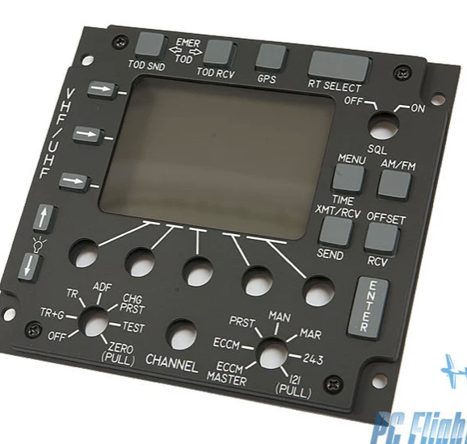
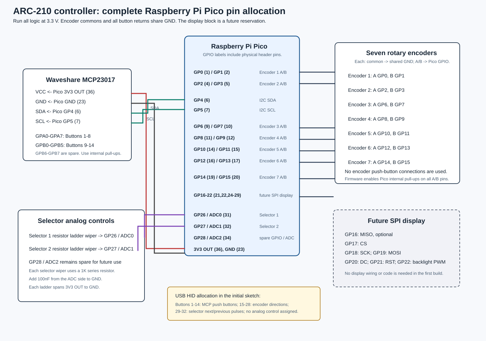
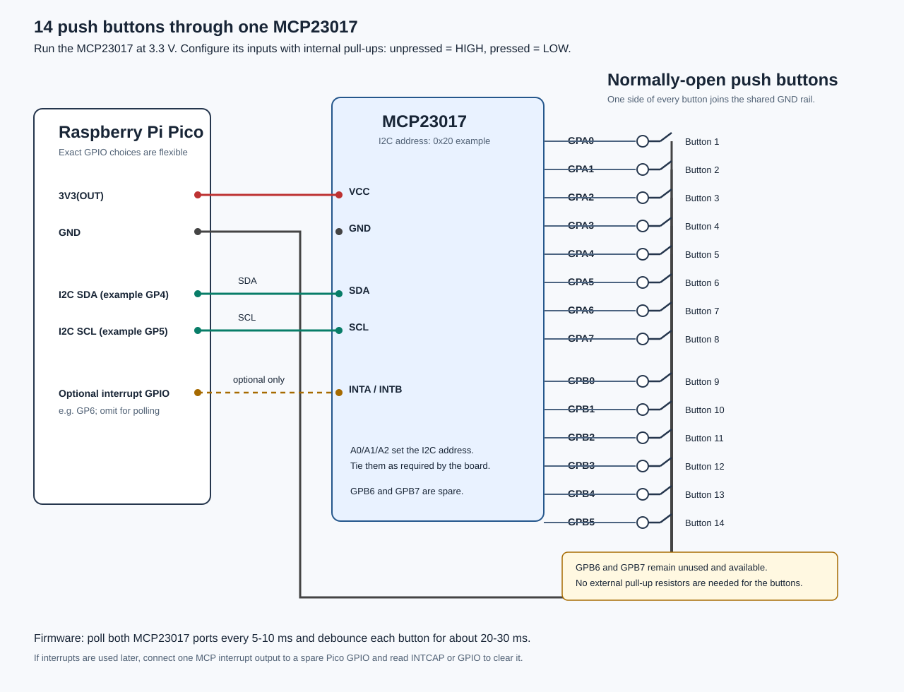
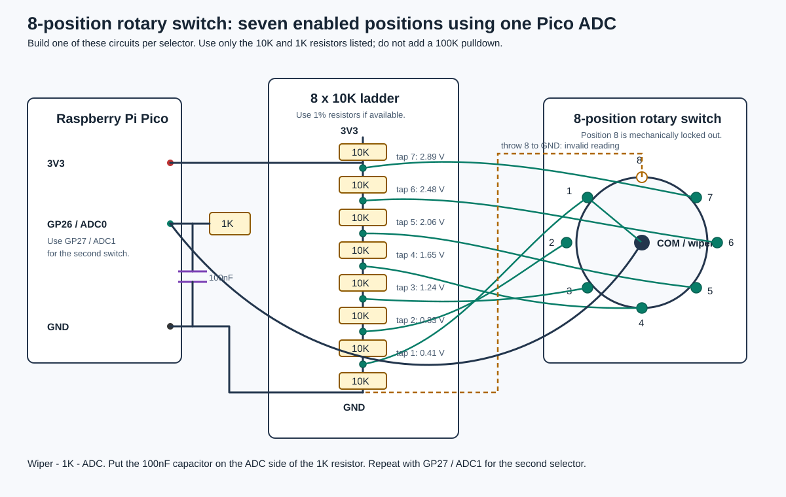

# ARC-210 wiring plan



# Summary

This project is a flight sim ARC-210 style radio panel for use with DCS. The first target interface is USB HID joystick/game-controller input from a Raspberry Pi Pico.

The panel needs to support:

- 14 push buttons
- 7 rotary encoders, without integrated push buttons
- 2 single-pole 8-position rotary switches with 45 degree throw; 7 usable positions each and the eighth mechanically locked out
- Optional SPI display later

# Main design decision

There are too many inputs for a clean direct-to-GPIO design on a Raspberry Pi Pico.

Raw direct input count:

- 14 push buttons = 14 digital inputs
- 7 rotary encoders = 14 digital inputs
- 2 rotary switches = 14 digital inputs when only 7 positions per switch are enabled

That would require 42 digital inputs before allowing any pins for an SPI display. The Pico does not have enough spare GPIO for that approach.

# Recommended architecture

Use the Pico for timing-sensitive and analog inputs, and use an I2C I/O expander for the simple push buttons.

Recommended allocation:

- Raspberry Pi Pico direct GPIO:
  - 7 rotary encoders, 2 GPIO per encoder
  - SPI display pins reserved for future use
  - I2C SDA/SCL for the I/O expander
- Raspberry Pi Pico ADC:
  - 8-position rotary switch 1 through an analog resistor ladder
  - 8-position rotary switch 2 through an analog resistor ladder
  - GP28 / ADC2 remains spare
- MCP23017 I2C I/O expander:
  - 14 push buttons
  - 2 spare expanded digital inputs

# Exact Pico pin allocation

The following allocation keeps all seven encoders on direct Pico GPIO, places the selector ladders on two of the three exposed ADC pins, and reserves a complete SPI display interface. Pin numbers in parentheses are Raspberry Pi Pico physical header pins.

| Function | Pico GPIO | Header pins | Wiring notes |
| --- | --- | --- | --- |
| Encoder 1 | GP0, GP1 | 1, 2 | A, B; encoder common to GND |
| Encoder 2 | GP2, GP3 | 4, 5 | A, B; encoder common to GND |
| MCP23017 I2C | GP4, GP5 | 6, 7 | SDA, SCL; I2C0 at 400kHz |
| Encoder 3 | GP6, GP7 | 9, 10 | A, B; encoder common to GND |
| Encoder 4 | GP8, GP9 | 11, 12 | A, B; encoder common to GND |
| Encoder 5 | GP10, GP11 | 14, 15 | A, B; encoder common to GND |
| Encoder 6 | GP12, GP13 | 16, 17 | A, B; encoder common to GND |
| Encoder 7 | GP14, GP15 | 19, 20 | A, B; encoder common to GND |
| SPI display MISO, CS | GP16, GP17 | 21, 22 | Reserve MISO only if the chosen display supports reads |
| SPI display SCK, MOSI | GP18, GP19 | 24, 25 | SPI0 clock and data output |
| SPI display DC, RST, backlight | GP20, GP21, GP22 | 26, 27, 29 | Backlight pin supports PWM dimming |
| Selector 1 ladder | GP26 / ADC0 | 31 | Switch 1 common/wiper through 1K |
| Selector 2 ladder | GP27 / ADC1 | 32 | Switch 2 common/wiper through 1K |
| Spare GPIO / ADC | GP28 / ADC2 | 34 | Available for future analog or digital input; may be used for an MCP interrupt line |

Power and ground allocation:

- Pico pin 36 `3V3(OUT)` powers the MCP23017 and both resistor ladders.
- Use accessible Pico GND pin 23 for the common ground circuit. Pin 33 (`AGND`) is not used. Encoder commons, button returns, the MCP23017, both selector ladders, and their 100nF capacitors may all share this ground circuit. If selector readings later prove noisy, shorten their signal and ground wiring before making larger wiring changes.
- Do not put 5V on any Pico GPIO, ADC, MCP23017 logic, or resistor-ladder connection.



# I/O expander

Recommended part: Waveshare MCP23017 IO Expansion Board I2C.

Use the MCP23017 for push buttons only. Rotary encoders should stay on Pico GPIO because they are timing-sensitive.

The MCP23017 adds 16 digital I/O pins while using only 2 Pico pins for I2C. The Pico remains in charge: it asks the MCP23017 for its input state over I2C, and the MCP23017 returns a 16-bit value where each bit represents one expander pin.

Suggested wiring:

```text
Pico 3V3  -> MCP23017 VCC
Pico GND  -> MCP23017 GND
Pico SDA  -> MCP23017 SDA
Pico SCL  -> MCP23017 SCL

Each push button:
MCP23017 input pin -> button -> GND
```

Use `GP4` for SDA and `GP5` for SCL. The Arduino sketch configures this I2C0 bus at 400kHz. The Waveshare board should provide the required I2C pull-ups; do not add more pull-ups until the board documentation has been checked.

Configure the MCP23017 inputs with internal pull-ups in firmware. No external pull-up resistors are required for the 14 buttons. A pressed button should read low.

Button state logic:

```text
button not pressed = input reads HIGH / 1
button pressed     = input connected to GND, reads LOW / 0
```

Suggested button pin mapping:

```text
Button 1  -> MCP23017 GPA0
Button 2  -> MCP23017 GPA1
Button 3  -> MCP23017 GPA2
Button 4  -> MCP23017 GPA3
Button 5  -> MCP23017 GPA4
Button 6  -> MCP23017 GPA5
Button 7  -> MCP23017 GPA6
Button 8  -> MCP23017 GPA7

Button 9  -> MCP23017 GPB0
Button 10 -> MCP23017 GPB1
Button 11 -> MCP23017 GPB2
Button 12 -> MCP23017 GPB3
Button 13 -> MCP23017 GPB4
Button 14 -> MCP23017 GPB5
Spare     -> MCP23017 GPB6
Spare     -> MCP23017 GPB7
```



## Polling versus interrupts

Selected approach: poll the MCP23017 every 5ms and debounce each button in firmware for about 20-30ms.

Polling is the preferred first implementation because it needs no additional Pico GPIO or wiring, is easy to debug, and has more than enough response speed for panel buttons. At a 5ms interval, a press is seen within 5ms before debounce; the I2C traffic and Pico CPU cost are negligible.

The MCP23017 interrupt outputs are useful only if future firmware needs to avoid idle I2C reads, put the Pico to sleep, or manages several expanders. Interrupts add an extra wire and more firmware state: switch bounce can cause repeated interrupts, and the Pico must read the MCP23017 `GPIO` or `INTCAP` register to clear the asserted interrupt.

Do not wire the interrupt output for the first version. A future version can connect mirrored, open-drain `INTA`/`INTB` to spare `GP28`, with a 3.3V pull-up, if interrupt-driven input becomes useful.

Button event flow:

```text
Button press
  -> MCP23017 input pin goes LOW
  -> Pico reads MCP23017 over I2C
  -> Pico sees that bit changed from 1 to 0
  -> Pico debounces the change
  -> Pico sends USB HID joystick button pressed to DCS
```

Run the MCP23017 board at 3.3V with the Pico. Keeping the control wiring at 3.3V avoids level-safety issues because Pico GPIO are not 5V tolerant.

The Waveshare board is preferred over a generic MCP23017 module because it is documented, exposes address selection, and exposes interrupt pins. The interrupt pins are optional; simple polling is acceptable for push buttons.

Multiple MCP23017 boards can share the same Pico I2C bus if they have different I2C addresses. The MCP23017 supports address selection with A0/A1/A2, which allows up to 8 MCP23017 devices on the same bus.

Possible future expansion:

```text
MCP23017 #1 at 0x20 -> 14 push buttons + 2 spares
MCP23017 #2 at 0x21 -> optional direct digital wiring for both 8-position switches
MCP23017 #3 at 0x22 -> spare expansion or future controls
```

If the two 8-position rotary switches are moved from ADC resistor ladders to an MCP23017 later, each switch uses 8 MCP23017 inputs. Both switches fit exactly on one MCP23017:

```text
Switch 1 common/wiper -> GND
Switch 1 throws 1-8  -> MCP23017 GPA0-GPA7

Switch 2 common/wiper -> GND
Switch 2 throws 1-8  -> MCP23017 GPB0-GPB7
```

This would make each selector position a plain digital input and would free ADC0 and ADC1. It costs another MCP23017 board, so the resistor ladder approach remains the cheaper first design.

# 8-position rotary switches (seven enabled positions)

The two 8-position switches are single-pole 8-position rotary switches.

Known switch specifications:

- Voltage rating: 125V
- Current rating: 2.5A AC, 350mA DC
- Actuator type: flatted, 6.35mm diameter
- Actuator length: 38mm
- Depth behind panel: 14.48mm
- Panel cutout: circular, 9.80mm diameter
- Number of positions: 8
- Angle of throw: 45 degrees

Recommended wiring approach: use each switch as an ADC resistor ladder so each rotary switch consumes one Pico ADC input instead of seven digital inputs.

The eighth physical switch position is mechanically locked out. The circuit therefore provides seven valid selector readings. Wire the disabled eighth throw to GND as an invalid diagnostic value, rather than leaving it floating.

## Resistor ladder concept

The Pico ADC reads voltage. A resistor ladder creates a set of known voltages between 3.3V and GND. The rotary switch selects one of those voltage taps and sends it to the ADC input.

Use one resistor ladder per switch. The two switches cannot share a ladder because each common/wiper needs an independent ADC voltage at the same time.



Physical wiring summary:

- 3V3 and GND feed the resistor ladder.
- The resistor ladder is a chain of 8 equal-value resistors between 3V3 and GND.
- The spaces between resistors are tap points, each with a different voltage.
- Seven outside switch terminals connect to the seven ladder taps.
- The locked-out eighth terminal connects directly to GND, producing an invalid ADC reading near zero if the lockout is ever defeated.
- The switch's center/common/wiper pin connects to the Pico ADC input.
- When the switch turns, it connects the ADC input to one selected ladder voltage.
- For the second 8-position switch, build the same circuit again and connect its common/wiper to a different ADC pin.

Recommended ladder:

```text
3V3
 |
[10k]
 |---- switch throw 7  ~2.89V
[10k]
 |---- switch throw 6  ~2.48V
[10k]
 |---- switch throw 5  ~2.06V
[10k]
 |---- switch throw 4  ~1.65V
[10k]
 |---- switch throw 3  ~1.24V
[10k]
 |---- switch throw 2  ~0.83V
[10k]
 |---- switch throw 1  ~0.41V
[10k]
 |
GND
```

The switch common/wiper is the output:

```text
Switch common/wiper -> 1k resistor -> Pico ADC input
Pico ADC input -> 100nF capacitor -> GND
```

The 1k resistor protects the ADC input from brief wiring or contact transients. The 100nF capacitor smooths noise and contact chatter, and provides a low-impedance source while the Pico ADC samples. A pulldown is not required. Do not use a 100k pulldown: it would load the ladder and shift the expected voltages. A 1M pulldown is optional only if it is bought separately.

## Recommended parts

For each rotary switch:

- 8x 10k ohm resistors, 1% metal film, through-hole, for the ladder
- 1x 1k ohm resistor for the ADC signal line
- 1x 100nF ceramic capacitor, X7R preferred
- Small perfboard or stripboard
- 24-26 AWG hookup wire
- Optional 3-pin connector for 3V3, GND, and ADC signal

Use the available 10k resistors for the ladder and the available 1k resistor in series with the ADC. Do not use the available 100k resistors in this circuit. With 8 x 10k resistors, the ladder is 80k total and draws about 41uA from 3.3V. The voltage steps are wide enough for reliable detection while keeping current draw low.

## Assembly steps

1. Use a multimeter to identify the switch common/wiper pin.
2. Build the 8-resistor chain on a small perfboard.
3. Connect the top of the chain to Pico 3V3.
4. Connect the bottom of the chain to the common ground circuit that returns to Pico physical pin 23.
5. Run one wire from each of the seven ladder taps to the corresponding active switch throw terminal.
6. Run the switch common/wiper through a 1k resistor to the Pico ADC pin.
7. Put a 100nF capacitor from the ADC pin side of the 1k resistor to GND.
8. Wire the locked-out eighth switch terminal directly to GND so it decodes as an invalid position if it is ever reached.
9. In firmware, read the ADC and map voltage ranges to positions 1-7.

Suggested Pico ADC allocation:

```text
Switch 1 common/wiper -> Pico GP26 / ADC0
Switch 2 common/wiper -> Pico GP27 / ADC1
Spare                  -> Pico GP28 / ADC2
```

## Expected ADC values

For a 12-bit ADC reading from 0-4095, approximate values are:

```text
Position 1:  512
Position 2: 1024
Position 3: 1536
Position 4: 2048
Position 5: 2559
Position 6: 3071
Position 7: 3583
Locked-out position: approximately 0 (invalid)
```

Firmware should define threshold ranges for each position instead of checking exact values. A good starting point is to place each threshold halfway between adjacent expected values, then require the decoded position to remain stable for 20-50ms before accepting the change.

# SPI display reserve

The design should reserve pins for a future SPI display. A typical SPI display may need:

- SCK
- MOSI
- CS
- DC
- optional RST
- optional backlight control

Using the MCP23017 for push buttons keeps enough Pico pins available for the display. Direct-to-GPIO wiring for all buttons and switch positions would make the SPI display difficult to add cleanly.

# Interface to DCS

Initial recommendation: USB HID joystick/game-controller firmware using Arduino with the Arduino-Pico core.

Benefits:

- Simple host-side setup
- DCS can bind buttons, encoders, and selector pulses through normal controller bindings
- No DCS-specific protocol required for the first version

DCS-BIOS may be worth considering later if the project needs bidirectional state, display synchronization, or aircraft-specific radio data.

# Firmware stack

Selected stack: Arduino IDE with the Arduino-Pico core.

This is the preferred final firmware environment because the project is a USB HID game-controller device, not just an input test rig. Arduino-Pico provides a familiar sketch workflow while retaining C++ performance and offering built-in USB joystick, keyboard, and mouse support. It is a practical fit on both Windows 11 and macOS.

Suggested implementation order:

1. Bring up the Pico in Arduino IDE with the Arduino-Pico board package.
2. Scan the I2C bus and confirm the MCP23017 address, expected to be `0x20` unless its address jumpers are changed.
3. Configure the 14 MCP23017 pins as `INPUT_PULLUP`; poll both ports every 5ms and debounce button state changes for 20-30ms.
4. Read the two selector ADC inputs; decode selector positions by threshold range and require a stable reading for 20-50ms.
5. Read the seven encoders directly from Pico GPIO.
6. Send button, selector, and encoder events through USB HID to DCS.

Why Arduino-Pico instead of the Pico SDK:

- Arduino-Pico is C++ with a straightforward sketch, library, compile, and upload workflow. It is easier to iterate on than a standalone CMake project.
- It already provides the USB HID joystick/game-controller capability this panel needs.
- The Pico SDK provides the most control over low-level timing and custom USB descriptors, but its toolchain and CMake project setup are more involved. It remains a good future option if this panel eventually needs a custom HID report beyond what Arduino-Pico provides.

Why use Python at all:

- CircuitPython and MicroPython are excellent for quick wiring checks because code can be changed and run rapidly, and CircuitPython has a maintained MCP23017 library.
- CircuitPython can also present a gamepad, but it requires HID configuration in `boot.py` and an additional helper module.
- For this project, Python is useful as a temporary diagnostic tool, not the selected final firmware stack.

Windows 11 and macOS are both suitable for Arduino-Pico. The finished Pico appears to the computer as a standard USB HID device, so DCS does not need a special driver.

## Initial controller sketch

The initial Arduino sketch is [arc210_controller.ino](./arc210_controller/arc210_controller.ino).

Arduino IDE setup:

1. Install the Arduino-Pico board package and select `Raspberry Pi Pico`.
2. Set `Tools -> USB Stack -> Pico SDK`; the Arduino-Pico `Joystick` library is provided by this USB stack.
3. Install `Adafruit MCP23X17` from Library Manager. Its dependencies, including Adafruit BusIO, should install automatically.
4. Upload the sketch with the Pico connected by USB.

The sketch presents one USB joystick with all 32 buttons used and no analog control assigned:

| HID controls | Source |
| --- | --- |
| Buttons 1-14 | MCP23017 push buttons |
| Buttons 15-26 | Encoder 1-6 positive and negative turns |
| Buttons 27-28 | Encoder 7 positive and negative turns |
| Buttons 29-30 | Selector 1 next and previous position pulses |
| Buttons 31-32 | Selector 2 next and previous position pulses |

The Arduino-Pico joystick descriptor supports 32 buttons, so this allocation uses its entire button capacity. The selectors intentionally emit relative next/previous pulses instead of using fourteen more held buttons, keeping the design within that limit. Bind each selector's next/previous buttons to the matching DCS increment/decrement commands. On startup, align the simulator state with the physical selector positions manually.

# Open items before final schematic

- Confirm the SPI display model and pin requirements
- Confirm the final USB HID report: 32-button capacity, encoder behavior, and selector behavior

# PCB Rev A work

The first PCB revision is a panel-sized button carrier. The 14 tactile buttons mount directly to the PCB; the seven encoders and two selectors remain faceplate-mounted and connect through harnesses.

Current design package:

- [PCB design notes](./pcb-revA/arc210-revA-design.md)
- [Mechanical placement reference](./pcb-revA/arc210-revA-mechanical.svg)
- [Preliminary electrical schematic](./pcb-revA/arc210-revA-schematic.svg)
- [KiCad panel reference board](./pcb-revA/ARC210_RevA_panel_reference.kicad_pcb)

Rev A uses a removable Raspberry Pi Pico in two 1x20 sockets, a socketed MCP23017-E/SP DIP-28 IC, and provisional 6x6mm tactile-switch footprints. It is not ready for fabrication until the exact tactile switch, button-cap/plunger arrangement, rotary-control dimensions, mounting method, and connector family are confirmed.
